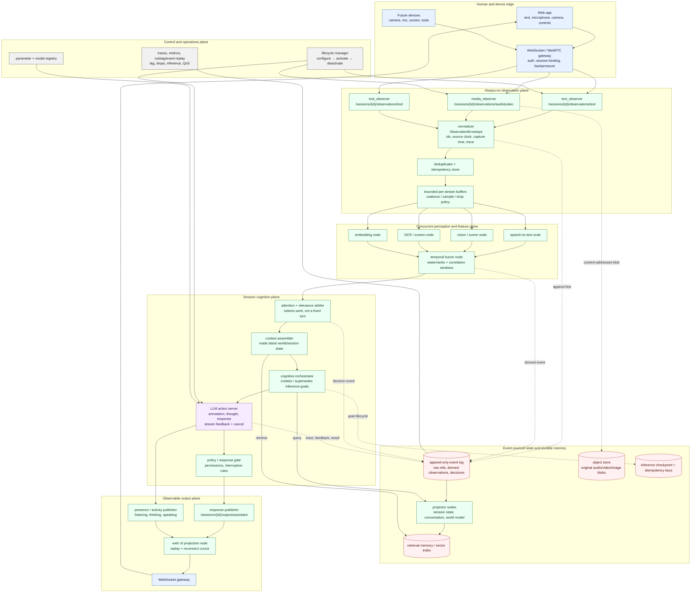

# ROS-focused always-on Harness

## Decision

Rebuild the application as an **event-driven cognitive system**, not as a
request handler which owns one complete inference run.  In this model, inputs
are immutable, timestamped observations on named streams.  Long-lived nodes
subscribe, transform them into increasingly useful representations, and emit
new observations.  The LLM is a cancellable asynchronous worker rather than
the main application loop.

Use ROS 2 concepts and interface discipline from the beginning: typed
messages, pub/sub topics for streams, actions for long-running inference,
services only for quick commands, lifecycle-managed nodes, and explicit QoS.
For a browser-only deployment, retain this topology and contracts but put a
WebSocket gateway at the edge; the gateway translates web messages to/from the
internal ROS graph.  Do not expose DDS directly to a browser.

This makes text, audio, video, tool events, and sensor events peers.  An
observation never needs to wait for an existing turn to finish before entering
the system.

## Foundation implemented in this branch

The first text-only vertical slice is implemented now:

- `ObservationEnvelope` and `AlwaysOnOrchestrator` accept durable,
  idempotent text observations without waiting for inference.
- The existing LangGraph Harness runs as a background inference worker with
  response persistence delegated to the orchestrator.
- New input supersedes in-flight output and replaces pending work; the current
  model server cannot stop an active decode, so a superseded result is recorded
  and discarded instead of displayed or stored as an assistant response.
- `/sessions/{session_id}/observations/text` provides HTTP acceptance and
  `/ws/sessions/{session_id}` supplies live feedback plus replay from a durable
  event-number cursor.
- The web UI uses that WebSocket path, with the old SSE route retained as a
  compatibility fallback.

The repository now also contains a Dockerized ROS 2 Jazzy workspace with
generated interfaces, a WebSocket-to-ROS gateway, attention/perception nodes,
a cancellable inference action server, session projection service, QoS profiles,
and a launch graph. See `docs/ros-deployment.md`. Real ASR/vision/OCR model
adapters, object-store upload implementation, lifecycle conversion of every
worker, and cooperative provider cancellation remain the next increments. The
contracts below are the target those additions must obey.

## Target system



### The core rule

An incoming item is not a "turn." It is an `ObservationEnvelope`.  A
conversation turn is merely one optional projection derived from a sequence of
observations.  This separates input capture from interpretation and prevents a
slow model response from blocking new human signals.

## ROS interface choices

| Need | ROS interface | Why |
| --- | --- | --- |
| Text, partial ASR, video frames, mouse/tool events, activity, output tokens | Topic | Continuous, many-to-many, asynchronous streams |
| Start/configure a session, fetch a snapshot, update prompt/model settings | Service | Short request/response control operations |
| Run model inference, retrieval, tool execution, media analysis | Action | Long-running, emits feedback, has a result, and supports cancellation |
| Start/stop/recover nodes | Lifecycle node + lifecycle services | Makes "listening" and "ready to infer" explicit and supervised |
| Conversation, world model, memory | Event log plus projector nodes | Rebuildable durable state; not hidden mutable node memory |

ROS topics are the right primitive for continuous streams, while services are
for short request/response work and actions give long work feedback and
cancellation.  That maps directly to observations, configuration, and LLM
runs respectively.  ROS 2 also supplies QoS policies, so latency-sensitive
media can prefer freshness while durable text/events can prefer delivery.

## Canonical message contract

All modalities should share an envelope; payloads are typed references rather
than cramming binary media into the bus.

```text
ObservationEnvelope
  observation_id: UUID                 # globally idempotent
  session_id: UUID
  source_id: string                    # browser tab, microphone, camera, tool
  modality: TEXT | AUDIO | VIDEO | IMAGE | TOOL | CONTROL
  sequence: uint64                     # monotonic per source
  captured_at: time                    # source/device time
  received_at: time                    # gateway clock
  correlation_id: UUID                 # same user gesture / media segment
  causation_id: UUID?                  # event that caused this item
  trace_id: string
  payload_ref: URI                     # inline bounded text or object-store URI
  content_hash: string
  schema_version: uint16
  expires_at: time?                    # especially useful for transient media
```

Derived messages retain `observation_id`, `correlation_id`, `causation_id`,
and `trace_id`.  This is mandatory for replay, diagnosing races, and showing a
human which signals informed a response.

Useful first interfaces:

```text
topic  /sessions/{id}/observations/text       ObservationEnvelope
topic  /sessions/{id}/observations/audio      ObservationEnvelope
topic  /sessions/{id}/observations/video      ObservationEnvelope
topic  /sessions/{id}/percepts                Percept
topic  /sessions/{id}/attention/decisions     AttentionDecision
topic  /sessions/{id}/outputs/assistant       AssistantOutput
topic  /sessions/{id}/activity                AgentActivity
action /sessions/{id}/infer                   RunInference
service /sessions/{id}/snapshot               GetSessionSnapshot
service /sessions/{id}/control                SessionControl
```

`RunInference` should carry an immutable `context_snapshot_id`, selected
observation IDs, response mode, and deadline.  Its feedback is structured
(`queued`, `retrieving`, `generating`, `token_delta`, `superseded`), and its
result contains output event IDs—not the sole copy of the response.

## Concurrency and interruption policy

The scheduler, not the browser request, owns the work queue.

1. Every observer immediately persists an accepted observation and publishes
   it.
2. Perception nodes run independently.  Audio can produce partial transcript
   events while video nodes are still working.
3. The attention arbiter windows signals by capture time and resolves whether
   they are background context, a material update, or an interaction that
   deserves an LLM goal.
4. The planner creates an inference action with a frozen context snapshot.
   More observations remain admissible while it runs.
5. A higher-priority observation (for example a human interrupting speech) can
   cancel or mark the active goal superseded.  It does not delete the old
   result; it records a terminal `superseded` event.
6. The policy node decides whether to emit, replace, queue, or suppress a
   response.  The UI renders output events in causal order.

Do **not** allow every video frame or partial transcript to start an LLM run.
Use modality-specific aggregation:

| Stream | Suggested initial QoS / aggregation | LLM trigger |
| --- | --- | --- |
| Submitted text | Reliable, durable event; no coalescing | Immediate |
| Live typing | Latest-only, 150–300 ms debounce | Explicitly opt-in; normally no response |
| Partial ASR | Best effort, latest segment | End-of-utterance or a stable intent |
| Audio/video raw | Best effort, bounded depth, blob ref | Percept or salient-change event |
| Tool/control events | Reliable, ordered, idempotent | Policy/priority-dependent |
| Assistant token stream | Reliable to gateway with reconnect cursor | Never feeds planner directly |

That distinction is important: an always-on system should be continuously
*aware*, not continuously generating.

## Mapping from the current app

| Current component | ROS-focused replacement |
| --- | --- |
| `POST /send` | Gateway publishes a text observation; it returns immediately after durable acceptance |
| In-request `asyncio` task | Action goal owned by the cognitive orchestrator |
| One per-chat `Harness` object | Stateless/re-entrant node workers plus durable session projections |
| LangGraph chunk → annotate → thought → respond | A versioned `RunInference` action implementation; internal graph remains permissible |
| SSE from one HTTP request | Subscribed output/activity topics bridged through a long-lived WebSocket; replay from cursor on reconnect |
| `chat_state.json` | Event log and materialized session/conversation projections |
| `events.jsonl` / `llama_io.jsonl` | Durable event/trace store; use rosbag/event replay for development and incident diagnosis |
| File lock per chat | Optimistic projection version plus idempotent consumer/producer behavior |

Keep the existing annotation/thought/response graph at first, but place it
behind the `RunInference` action server.  It becomes an implementation detail
that can be split into separate workers later; its inputs and outputs must be
event IDs and frozen snapshots, not a live mutable `Harness` instance.

## Deployment boundary

ROS 2/DDS is excellent inside a trusted local or robot network.  A web app
needs a gateway because browsers do not natively participate in DDS discovery
or authenticate like an application API.  The gateway must:

- authenticate and authorize the user/session;
- convert WebSocket/WebRTC inputs to the typed internal contracts;
- enforce per-user rate and byte limits before the ROS graph;
- upload binary media to object storage and publish only references;
- maintain an output cursor so a reconnect replays missed durable output;
- never give a client authority to publish directly to internal control,
  policy, or model topics.

For non-robot cloud deployment, the same design can use a durable event broker
behind the ROS-facing adapter.  The architectural win is the contracts,
supervision, and event flow—not a requirement to force raw DDS across the
internet.

## Failure model

- **At-least-once delivery:** every consumer deduplicates on
  `(source_id, sequence)` and `observation_id`.
- **No hidden correctness state:** an action may cache model/KV state for
  performance, but decisions and output are recoverable from durable events.
- **Backpressure is explicit:** overflow policy varies by topic.  Dropping an
  old video frame is acceptable; dropping a submitted text message is not.
- **Replay is first-class:** re-run a projection or inference from recorded
  observation IDs and an immutable model/prompt/config version.
- **Lifecycle health:** nodes expose ready/active/error states; the lifecycle
  manager never routes new goals to an inactive model worker.

## Incremental build plan

1. **Separate acceptance from inference.** Keep FastAPI, but replace the
   `/send` execution path with durable `ObservationEnvelope` creation and a
   background orchestrator.  Add a WebSocket output stream with event cursors.
2. **Introduce event sourcing and idempotency.** Add an append-only session
   event store, object storage references, and projector-built chat state.  Do
   this before adding media.
3. **Wrap the existing graph as an action.** Give every run a deadline,
   cancel/supersede semantics, structured progress, config/model versions, and
   frozen input snapshot.
4. **Add the attention arbiter.** Initially trigger only on final submitted
   text, then add debounced live typing and endpointed ASR.
5. **Add modalities independently.** Media observers and perception nodes
   publish `Percept` events; neither may call the LLM directly.
6. **Move internal seams to ROS 2.** Define packages/interfaces, lifecycle
   nodes, QoS profiles, rosbag replay, and gateway bridges once contracts are
   stable.  Keep compute-heavy model runtimes behind action workers.

The first releasable milestone is therefore not "camera support."  It is an
always-on text system where input acceptance, inference, output, cancellation,
and recovery are separate asynchronous concerns.  Once that works, multimodal
support adds producers and perception nodes—not a new control model.
